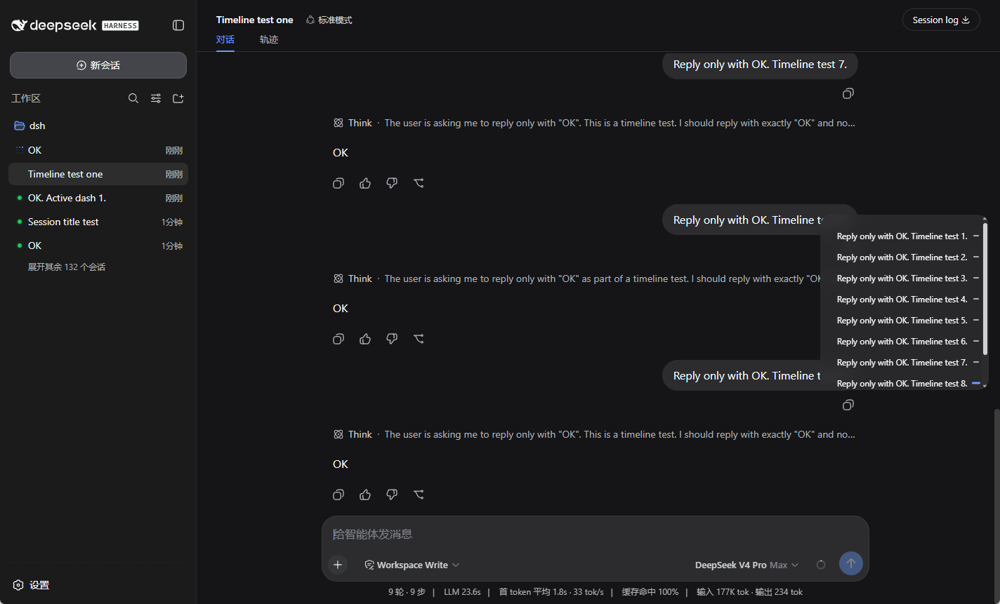
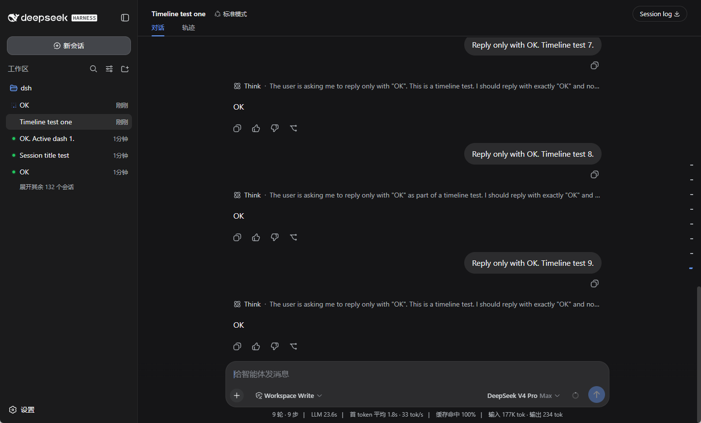

# dsh-conversation-outline

给 DeepSeek Harness（DSH）加一个 **对话导航条**：在消息界面右侧悬浮显示本次会话的用户提问时间轴。收起时只显示一列短横线，hover 后向左展开半透明面板，显示每条提问的标题，点击即可跳转到对应消息，滚动对话时还会自动高亮当前阅读位置。

## 更新记录

### v0.2.16

- **修复：在 DSH 0.1.5 上导航条完全不渲染。** 两个原因叠加：

  1. **挂载位置失效**。插件原先挂在 `shell.overlay` 上——那是 **root 作用域**（`{ kind: 'list', scope: 'root' }`）。旧版靠往里面塞一个 `SessionProvider` 来「借」会话作用域，但在 0.1.5 里 `renderSessionArea` 拿到的 `binding.key` 是 undefined，于是直接渲染 empty（null），rail 消失。现在改挂**会话作用域**的 `conversation.session.header.utilities`，`useSession` / `useChat` 由框架直接绑定，不再需要桥接。
  2. **chat 数据换了位置**。0.1.5 把 chat 投影从会话快照里搬走了：会话快照现在只有 `sessionId / queue / running / hasMore / …`，**没有 `chat`**；chat 改由 `ui-chat` 通过 `uiSession.provide({ hooks: { chat } })` 以独立 **`useChat`** hook 提供。插件原先读 `useSession(s => s.chat.order)`，因此抛 `Cannot read properties of undefined`。

- **外观与行为不变**：仍是右侧 34×300 垂直居中的悬浮 rail（hover 展开、点击跳转、滚动高亮）。定位改为 `position: fixed`，右边界从 `[data-conversation-scroll]` 实测得出（已排除侧栏），因此不再依赖宿主必须是全高容器。
- 测试从 54 项中的 host 组同步到新 props 形状。

## 预览

### 展开状态



### 收起状态



## 功能

- 右侧 34×300 垂直悬浮 rail，上下居中
- 收起只显示短横线，不占空间
- hover / focus 向左展开圆角玻璃面板，左侧标题、右侧横线在同一框内
- 点击标题或横线平滑滚动到对应消息
- 滚动时按 40% 阅读线自动高亮当前提问
- 自动加载更早历史（`loadOlder`）后跳转
- 支持键盘操作与无障碍
- 适配 DSH 深色模式
- 少于 2 条用户提问时自动隐藏

## 怎么安装（手动安装）

### 你需要先有

- 电脑上已经能用的 DSH（终端里 `dsh` 命令能跑）

### 两步装好

**第 1 步**：到本仓库的 Release 页面下载 `dsh-conversation-outline-0.2.16.tgz`，然后在终端执行：

```sh
dsh plugin --profile web add ./dsh-conversation-outline-0.2.16.tgz
```

**第 2 步**：重启 DSH Web 服务（先停止当前的 `dsh web`，再重新启动）。

安装后，在 **设置 → 插件 → 插件列表** 中会显示为 **`conversation-outline`**。导航条会出现在对话右侧。

### 从 GitHub 直接安装（不下载文件）

```sh
dsh plugin --profile web add github:SuperPaiGu/dsh-conversation-outline
```

装完同样需要重启 DSH Web 服务。

### 卸载

```sh
dsh plugin --profile web remove dsh-conversation-outline
```

## 怎么安装（Agent 安装）

> 由 AI Agent 在用户机器上执行的确定性指令，按顺序执行，每步有验收条件。

### 0. 环境检测

```sh
dsh --version    # 命令不存在则提示用户先安装 DSH
```

### 1. 安装插件（首选 GitHub，无需下载文件）

```sh
dsh plugin --profile web add github:SuperPaiGu/dsh-conversation-outline
```

**验收**：退出码 0，输出含 `+ dsh-conversation-outline`。

（如需固定版本：从 Release 下载 `dsh-conversation-outline-0.2.16.tgz`，用 `dsh plugin --profile web add ./dsh-conversation-outline-0.2.16.tgz`。）

### 2. 重启 DSH Web 服务

停止当前 `dsh web`，再以用户原有方式重新启动。

**验收**：启动日志无报错；`设置 → 插件 → 插件列表` 中 `conversation-outline` 行为 active。

### 3. 验收清单

- [ ] 第 1 步退出码 0
- [ ] `dsh --profile web --dump-config` 含 `conversation-outline` 层
- [ ] 重启后对话右侧出现导航条

## 目录结构

```
dsh-conversation-outline/   插件根
├── package.json            dsh.bundle + dsh.client 声明
├── cordis.patch.yml        插件层（id conversation-outline）
├── index.js                服务端入口
├── client.js               Web 客户端：导航条 UI 与交互
├── tests/                  单元测试与 E2E 测试
└── README.md
```

## License

MIT
